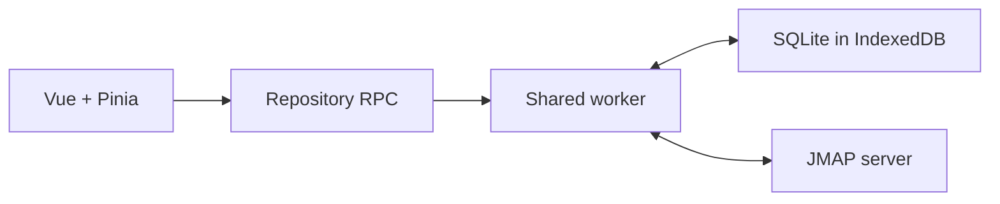

# Stormbox architecture

Stormbox is a Vue 3 and Pinia webmail client backed by a browser-local SQLite
cache. UI code calls a repository RPC boundary; a shared worker owns SQLite,
JMAP transport, synchronization, and the durable mutation outbox. The JMAP
server remains authoritative, while indexed local data keeps the interface
responsive and available across tabs.

Core boundaries:

- Components and stores contain UI state, not protocol or database logic.
- The shared worker is the single local writer and serializes SQLite access.
- Sync pulls authoritative server state into account-scoped local tables.
- User mutations enter a durable outbox before JMAP writes and local reconciliation.
- Full message HTML is sanitized and rendered in a sandboxed iframe.
- Shared session accounts (`is_personal = 0`) sync their mailbox trees
  through the same worker; folder operations resolve the owning account.
- Folder lists read JMAP `Email/query` positions from `query_view_items`;
  `query_views.total` is the open-window count.
- Synced settings live at `thundermail/stormbox-settings.json`; contacts
  trash shards live under `thundermail/contacts_trash/`.

## Detailed documents

- [Performance and runtime](performance.md) — worker topology, synchronization,
  caching, batching, and measured performance constraints.
- [SQLite storage](sqlite-storage.md) — schema, identifiers, relationships,
  migrations, and cache design.
- [Pinia store contract](stores.md) — responsibilities, lifecycle, state shape,
  and repository boundaries for stores.
- [Safe rendering](safe-rendering.md) — sanitization, iframe sandboxing, CSP,
  and handling of untrusted HTML.
- [User settings](user-settings.md) — local settings state and cross-device
  FileNode synchronization.
- [Contacts trash](contacts-trash.md) — durable contact deletion, sharding,
  restoration, and convergence.

Project-wide invariants are defined in the
[constitution](../../.specify/memory/constitution.md); feature requirements
live in [specs](../../specs/).
