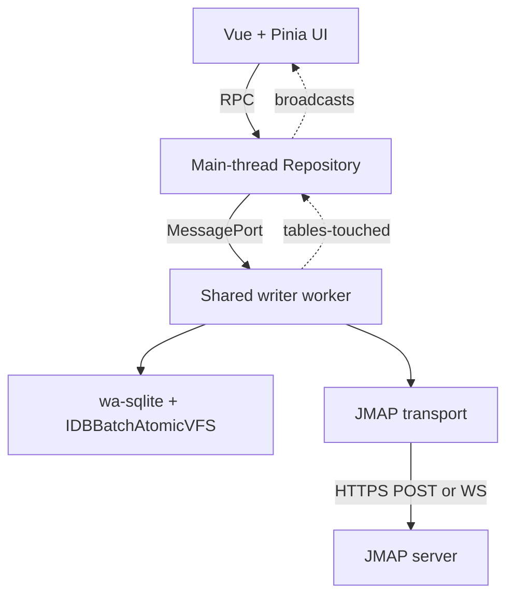
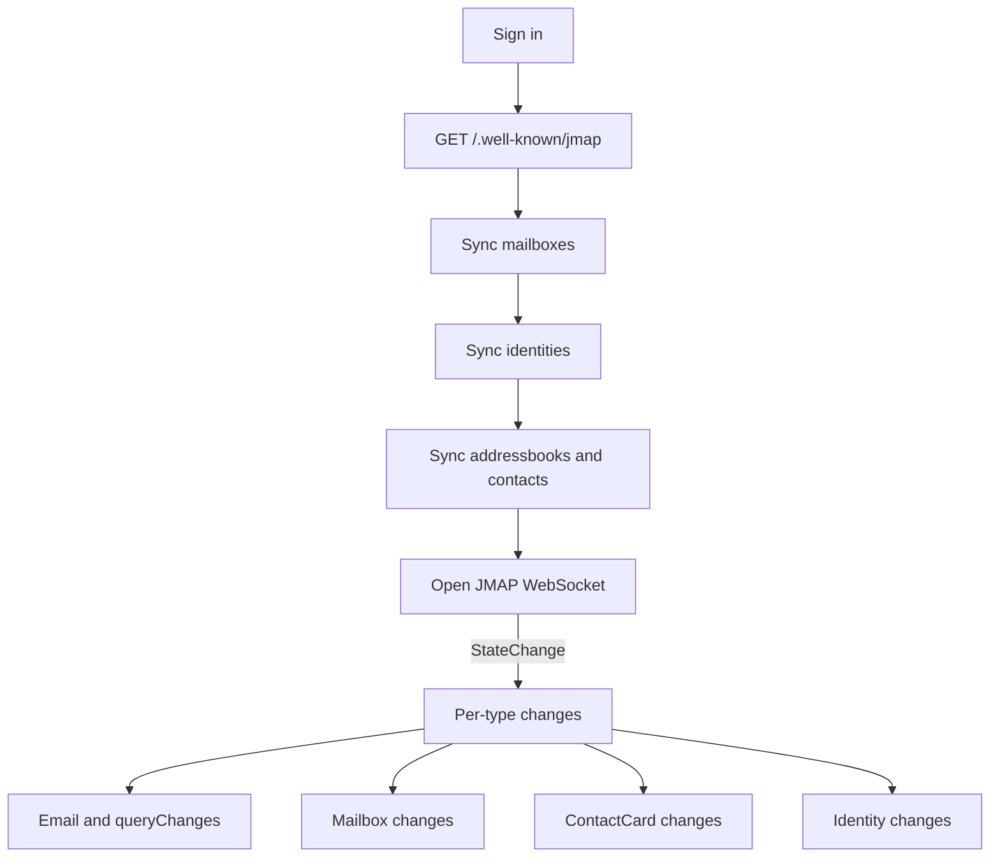

# Stormbox Performance and Architecture Notes

Field guide for developers working on Stormbox's sync, storage, or
list/detail UI. Project-wide invariants live in
`.specify/memory/constitution.md`. Schema and query rationale live in
`sqlite-storage.md`.

## High-level architecture

Stormbox is a Vue 3 + Pinia single-page app talking to a JMAP server.
Local data lives in browser-local SQLite (`@journeyapps/wa-sqlite`)
hosted in a single shared writer worker per origin. The UI never
calls JMAP directly: the worker owns the JMAP transport, drives sync,
and exposes a small RPC surface to Pinia stores.

Today the worker is a `SharedWorker`. A leader-elected
`DedicatedWorker` fallback is acceptable on browsers that do not ship
SharedWorker (e.g. Android Chrome).

## Storage backend

The SQLite database is backed by IndexedDB through wa-sqlite's
`IDBBatchAtomicVFS`. IndexedDB's batch atomic transactions stand in
for SQLite's external journal file, so the VFS performs well without
WAL.

Why IndexedDB rather than OPFS:

- The OPFS VFSes that work in a SharedWorker (`OPFSAnyContextVFS`,
  `OPFSAdaptiveVFS`) cannot use SQLite WAL because OPFS's async API
  does not support the shared-memory primitives WAL needs.
  `OPFSAnyContextVFS` was measured 5-8x slower than
  `IDBBatchAtomicVFS` on representative delete-under-indexer-churn
  workloads (see `research/vfs-bench/`).
- Faster OPFS VFSes (`AccessHandlePoolVFS` + WAL,
  `OPFSCoopSyncVFS`) use `createSyncAccessHandle`, which Firefox
  restricts to dedicated workers. They are incompatible with the
  current SharedWorker topology but stay viable for a future
  DedicatedWorker leader setup.
- `IDBBatchAtomicVFS` works in any worker context and stays within
  a factor of two between Chromium and Firefox on typical workloads.

`PRAGMA journal_mode=WAL` is not set: with `IDBBatchAtomicVFS` it has
no effect. `PRAGMA synchronous=NORMAL` is kept as a documented
performance win for this VFS.

## Worker topology and the engine lock

Tabs talk to the worker through a per-tab `MessagePort` for RPC and a
shared `BroadcastChannel` that names the table families touched by
each write. Stores subscribe and re-run their queries when relevant
families fire.

wa-sqlite holds a single connection. Concurrent step calls on that
connection interleave at row boundaries and deadlock. The Engine
serializes every public exec/all/get/run on a per-engine promise
tail. `transaction()` acquires the lock once and passes the callback
a `TxContext` whose helpers run SQL on the held connection without
re-acquiring it.

This shape is required because background sync runs SQL outside any
inbound RPC, so a queue at the RPC dispatcher only is not enough; the
serialization lives one layer down, in the engine itself.

Implication: every SQL operation contends on the same lock. The
*shape* of writes matters more than usual — many small operations
queue behind one another, while batched operations dominate cost.

## Sync flow

`JmapBackend.start()` returns as soon as the local account row and
folder tree are populated. Identities, contacts, and the WebSocket
are kicked off in the background so the UI can paint a folder list
within one round trip of "login complete".

Visible folder windows load through `JmapBackend.ensureFolderWindow()`,
which runs a chained `Email/query + Email/get` in a single envelope
using JMAP back-references (RFC 8620 §3.1.3). The `Email/get` call
references the previous query's result via
`"#ids": { resultOf: 'q1', name: 'Email/query', path: '/ids' }`. The
change path uses `path: '/added/*/id'` to pull just newly-added ids
out of an `Email/queryChanges` response. One envelope replaces two
HTTP round trips and is the precondition that makes WebSocket
transport an actual win over HTTP.

A low-priority background metadata indexer fills `query_view_ranges`
gaps chunk by chunk and yields whenever foreground fetches or outbox
mutations are active. Cooperation is via a single counter
(`_foregroundFolderWindowCount`) the user-driven and outbox paths
both increment.

## Mutation pipeline

User actions enqueue rows in `pending_mutations` and drain through
`OutboxRunner`. The runner wakes on three triggers: a row inserted
via the DB layer hook, a JMAP `StateChange` push, and a backoff
timer.

After a successful `Email/set`, the local cache is reconciled
in-process from `outbox.ts`. Move and destroy paths call the
protocol-neutral `OUTBOX_APPLY_MOVE_BATCH` /
`OUTBOX_APPLY_DESTROY_BATCH` worker handlers directly, which mirror
the exact server-confirmed id set in one engine transaction: replace
`folder_messages` rows, drop affected query view items, compact
positions once per view, decrement `query_views.total`, and mark
added-folder views stale. Send and the `notUpdated`/`notDestroyed`
fallback are JMAP-specific (they issue an `Email/get` to reconcile)
and live in `applySendLocally` / `reconcileMessageFromServer` in
`outbox.ts`.

Trash semantics: ordinary delete moves to Trash via `moveToFolders`.
Permanent destroy is reserved for messages already in Trash or
explicit destroy flows.

`destroyMessage` and `destroyMessages` share a single code path:
each chunk is one `pending_mutations` row whose `request_json`
carries `messageIds: [...]`, dispatched as one `Email/set` per
outbox row. Move and destroy split into chunks of
`BULK_OPERATION_BATCH_SIZE` (500) ids in the mail store before
enqueueing; selections at or below that size go through as a single
row, larger selections are dispatched as N sequential chunks while
the `BulkOperationOverlay` shows progress and blocks other input.
Each successful server chunk is mirrored by one SQLite transaction
over the same confirmed ids, so the server write boundary and local
cache apply boundary match exactly. Splitting matters because Stalwart silently drops a single
`Email/set` that overflows its internal batch handler — the user
previously saw a meaningless `noResponse` after eight backoff
retries before the runner gave up. The outbox surfaces the JMAP
method-level error (RFC 8620 §3.6.1) directly when the response
slot is missing, so the user sees an actionable type
(`requestTooLarge`, `limit`, …) instead of `noResponse`.

## JMAP edge bridge

Browsers cannot set `Authorization` on `new WebSocket(url, protocols)`,
and JMAP `/jmap/ws` (RFC 8887) authenticates only via that header.
The Cloudflare Worker at `infra/jmap-bridge/` accepts
`?access_token=<bearer>` (RFC 6750 §2.3) or `?basic=<base64>` on the
`wsmail.*.thundermail.com` hostname's `/jmap/ws` upgrades, strips
the credential from the forwarded URL, sets the upstream
`Authorization` header, and proxies the WebSocket.

The same Worker fronts `/.well-known/jmap` and `/jmap/*` over HTTP
on the `jmap.*.thundermail.com` hostnames. The bridge owns CORS
itself: it allowlists the webmail origins (plus localhost on stage
for vite dev), short-circuits preflights, and echoes back
`Access-Control-Allow-Origin` only when the request `Origin` is in
the allowlist — so the SPA's JMAP calls work cross-origin without
needing Stalwart's CORS to be touched. It rewrites session-document
URLs from `mail.*` to `jmap.*` for HTTP fields and to `wsmail.*`
for the WebSocket capability so every URL the client subsequently
dereferences stays inside the bridge.

The worker captures `fetch` and `WebSocket` once at startup and
binds them to `globalThis`. Firefox's SharedWorker enforces the
WorkerGlobalScope receiver on `fetch`, so a captured-and-called
function without binding throws "called on an object that does not
implement interface WorkerGlobalScope".

## Performance patterns

Each pattern below is paired with the issue that motivated it. The
goal is to capture *why* the code looks the way it does so the
constraint is not lost when the implementation evolves.

### Cache-first folder navigation

**Issue.** Naive `selectFolder` blanked the message list, allocated
fresh paint state, and waited for a JMAP round trip on every click —
even for folders whose rows already lived in SQLite. Re-entering
Inbox after viewing Archives showed a multi-second spinner against
a small folder.

**Pattern.** The mail store keeps a per-folder cache map
(`Map<folderId, FolderCache>`) that survives across `selectFolder`
calls and lives for the user's session. `selectFolder` restores the
matching entry, binds `messages.value` to its rows, and shows a
spinner only when the folder has no painted offsets yet. Each folder
owns its own `pageInflight` so rapid folder switches do not stack up
behind a previous folder's pending load.

### Positional list reads

**Issue.** A SQL `OFFSET` over `folder_messages` returned zero rows
at high offsets when the cache was sparse. A deep scroll into row
1500 of a 3000-message folder asked SQLite for `OFFSET 1500 LIMIT 100`
of essentially nothing, and the virtualizer sat on placeholder rows
forever even after the matching JMAP page had been persisted.

**Pattern.** Folder list reads use `MESSAGE_LIST_FOR_VIEW`, which
joins JMAP-position-keyed `query_view_items` to `messages` on
`(account_id, remote_id)` rather than reading `folder_messages` by
position. The matching `query_views` row is found via the
`(account_id, view_type, folder_id, filter_json, sort_json, collapse_threads)`
unique index, so the lookup is an index probe.

`query_views.total` is the authoritative row count for the open
window. `folders.total_emails` is treated as a hint when the two
disagree after a delete or move.

### Batched persistence

**Issue.** Persisting a 500-message chunk took roughly 68 s end to
end, while the network half (`Email/query` + `Email/get`) for the
same chunk took roughly 2.4 s. The persist path fanned one network
response out into hundreds of small SQLite workflows: each
`FOLDER_MEMBERSHIP_REPLACE` opened its own transaction, and
`MESSAGE_UPSERT_MANY` ran a per-message `SELECT id` and per-message
side-table rebuild inside a single outer transaction.

**Pattern.** Match the SQL batch shape to the network batch shape:

- Resolve all folder ids and all remote message ids once per batch.
- Persist a foreground folder window through `FOLDER_WINDOW_PERSIST_BATCH`:
  query view metadata, positional rows, range coverage, threads,
  messages, addresses, keywords, and folder memberships all commit
  with the current `Email/query` / `Email/get` page.
- Use `FOLDER_MEMBERSHIP_REPLACE_MANY` to delete and re-insert every
  touched membership row in one transaction.
- Rebuild `message_addresses` and `message_keywords` with batched
  `DELETE ... WHERE message_id IN (?)` followed by a single bulk
  insert, all inside one transaction.
- Persist body prefetch pages through `MESSAGE_BODY_PERSIST_BATCH`, so
  `body_parts`, `body_values`, and `messages.body_fetched_at` update
  once per `Email/get` body page instead of once per message.
- Use the shared set-based query-view compactor for removals; do not
  run one `UPDATE query_view_items SET position = position - 1` per
  removed row.

This keeps transactions bounded by the current protocol page/chunk.
Foreground reads can still interrupt between pages; background
indexing and body prefetch must not aggregate multiple pages into one
larger transaction.

`query_view_items` upserts handle both the `(view_id, position)` and
`(view_id, remote_id)` unique constraints so foreground/background
overlap does not raise uniqueness errors.

### Body prefetch and priority display

**Issue.** Clicking the first messages in a folder always waited on
a body fetch. A naive batch path also forced a click during an
in-flight prefetch to wait for the entire batch to finish.

**Pattern.** The mail store owns a deduped, single-concurrency body
prefetch queue. Selecting a message enqueues the selected id plus
nearby visible rows; opening a small folder enqueues a short prefix
of bodies. Bodies are fetched via `SYNC_ENSURE_MESSAGE_BODIES`, which
resolves local ids to remote ids, skips messages with
`body_fetched_at` already set, and issues one `Email/get` per batch.

The reading-pane path is separate: `getMessageBodyForDisplay` reads
SQLite first and, on cache miss, runs a priority single-id
`Email/get` that does not block on the prefetch batch in flight. The
batch persistence path still commits at most the current body page, so
priority display fetches wait behind a bounded transaction rather than
behind an entire background queue.
backend tracks both `_bodyFetchInflight` (batch) and
`_bodyPriorityInflight` (display) to dedupe overlapping requests
across paths.

### Optimistic UI splice on mutations

**Issue.** Even after the outbox cache effects updated SQLite atomically, the
mail store waited for a follow-up `MESSAGES` broadcast and then
re-read the folder window before painting. Each delete carried
roughly 200-400 ms of round-trip latency on top of the JMAP call,
even when the JMAP call itself completed in a few milliseconds.

**Pattern.** Once the outbox returns success, the mail store splices
the deleted ids out of `messages.value` synchronously. The eventual
broadcast still fires `refreshLoadedPages`, which confirms in the
background through the coalescing path below. Other tabs and other
sources of change still come through broadcast + refresh; the splice
short-circuits only the self-induced case.

### Coalesced refresh after bulk apply

**Issue.** Bulk mutations emit one `FOLDER_MEMBERSHIP_REPLACE` plus
`QUERY_VIEW_APPLY_CHANGES` per id, which fires N `MESSAGES`
broadcasts. With per-id SQLite reads in between, deleted rows
disappeared from the list one at a time even though the JMAP round
trip was a single batched call.

**Pattern.** `refreshLoadedPages` runs single-flight with a dirty
flag: any concurrent call during an in-flight refresh sets the flag,
and the inflight pass re-runs once at the end if the flag is set. A
burst of N broadcasts collapses into at most two cache re-reads, so
the list shrinks in one visible step.

### Scroll prefetch with leading + trailing throttle

**Issue.** A leading-edge-only throttle on the virtualizer scroll
watcher dropped every fire after the first within the throttle
window. With a fast VFS, the initial `_loadPage` finished before the
user released the scrollbar, so the final visible range never got a
load and rows stayed as placeholders forever. The previous, slower
VFS masked the bug because the inflight `.finally` re-pump covered
the gap.

**Pattern.** The watcher schedules a trailing-edge timer when its
call is throttled, so the final visible range always gets a load.
The trailing timer is rescheduled on every subsequent throttled fire
(so it always targets the most recent range) and cleared once a
non-throttled call goes through.

## Authentication and secure context

The dev server runs on HTTPS with a self-signed cert
(`@vitejs/plugin-basic-ssl`). Browsers gate SharedWorker, IndexedDB
transactions, and SubtleCrypto on a secure context (HTTPS or
`http://localhost`); a plain HTTP origin silently disables them.

Authentication has two paths: Keycloak OIDC on hosted/development
flows, and basic username/password for self-hosters. Both feed
`Authorization` to the JMAP transport. Bearer tokens ride on the
WebSocket via the proxy described above.

## Code layout

- `src/db/engine.ts`, `src/db/bootstrap-idb.ts`: wa-sqlite engine and
  IndexedDB VFS bootstrap. The Engine serializes all SQL on a
  per-engine promise tail.
- `src/db/handlers.ts`: RPC handlers that own SQL writes. Bulk
  primitives (`MESSAGE_UPSERT_MANY`,
  `FOLDER_MEMBERSHIP_REPLACE_MANY`, `MESSAGE_LIST_FOR_VIEW`,
  `QUERY_VIEW_PROGRESS`, `OUTBOX_APPLY_MOVE`,
  `OUTBOX_APPLY_DESTROY`) live here.
- `src/db/protocol.ts`: RPC method names and `TABLE_FAMILIES`
  constants.
- `src/db/repository.ts`: main-thread RPC client used by stores.
- `src/sync/backends/jmap/`: JMAP transport, mailbox/email/contact/
  identity sync, body fetch, outbox, and the `JmapBackend`
  orchestrator.
- `src/stores/mail-store.ts`: per-folder cache, virtualized list
  state, body prefetch queue, scroll-position persistence, broadcast
  handling.
- `src/components/MessageList.vue`: virtualized list using
  `@tanstack/vue-virtual`.
- `infra/jmap-bridge/`: Cloudflare Worker fronting both halves of
  the JMAP transport — the WebSocket auth bridge on `wsmail.*` and
  the HTTP proxy with first-party CORS on `jmap.*`.
