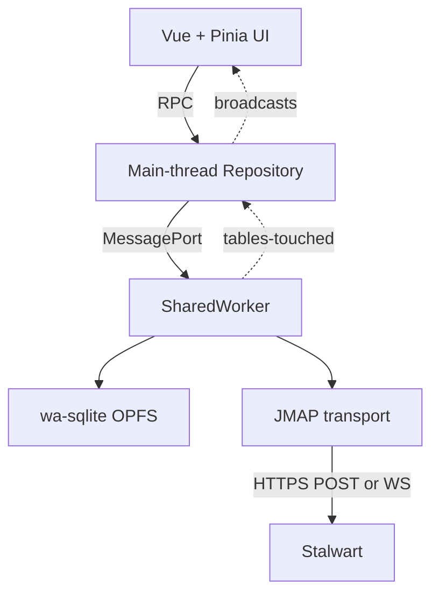
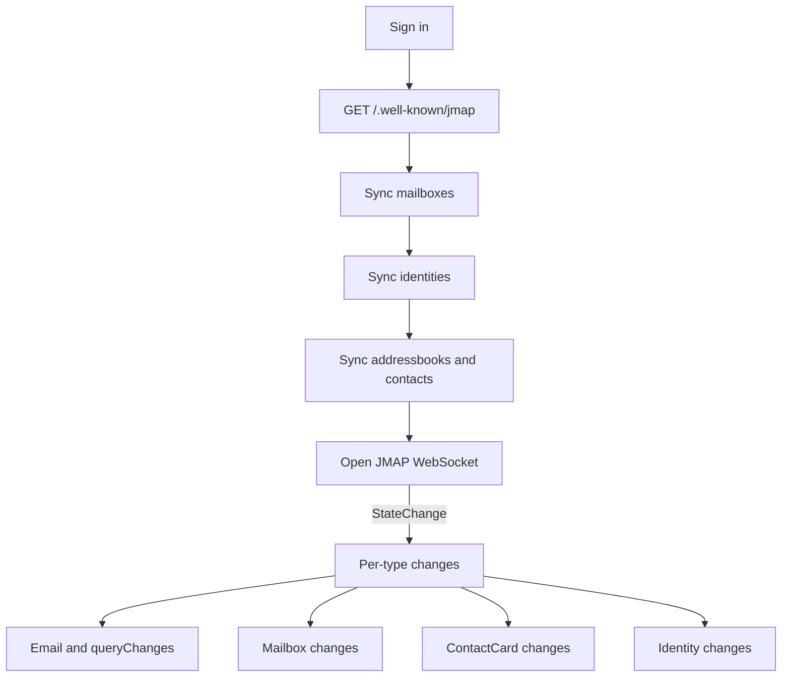

# Stormbox Performance and Architecture Notes

These notes summarize the architecture of the Stormbox webmail MVP and the
performance work done so far. They are an internal field guide, not user
documentation. They are intended to capture the design choices, the
known-good state of the code, and the open performance work for future
contributors.

## High-level Architecture

Stormbox is a Vue 3 + Pinia single-page app that talks to a Stalwart JMAP
server. Local data lives in OPFS-backed SQLite (`@journeyapps/wa-sqlite`),
hosted in a `SharedWorker` so multiple tabs share one connection and one
database. The UI never calls JMAP directly: the SharedWorker owns the JMAP
transport, drives sync, and exposes a small RPC surface to Pinia stores.

Key principles:

- Pinia stores read from SQLite via `Repository` RPC; they do not call
  JMAP. Reads return whatever is local immediately so navigation feels
  instant.
- The SharedWorker is the only writer. After every write batch it
  publishes a `tables-touched` broadcast naming the affected table
  families. Stores subscribe and re-run the queries they care about.
- The schema is multi-account and protocol-neutral. Local primary keys
  are integers; remote ids are stored as data and scoped per
  `account_id`. JMAP-specific behavior lives only in
  `src/sync/backends/jmap`.
- Bodies are an LRU cache, not durable source-of-truth data. List
  metadata is durable.

## Code Layout

- `src/db/engine.js` and `src/db/bootstrap-opfs.js`: wa-sqlite engine and
  OPFS VFS bootstrap. The Engine serializes all SQL on a per-engine
  promise tail to avoid wa-sqlite handle interleaving.
- `src/db/handlers.js`: RPC handlers that own SQL writes. Bulk
  primitives like `MESSAGE_UPSERT_MANY`, `FOLDER_MEMBERSHIP_REPLACE_MANY`,
  `MESSAGE_LIST_FOR_VIEW`, `QUERY_VIEW_PROGRESS` live here.
- `src/db/protocol.js`: RPC method names and `TABLE_FAMILIES` constants.
- `src/db/repository.js`: Main-thread RPC client used by stores.
- `src/sync/backends/jmap`: JMAP transport, mailbox/email/contact/
  identity sync, body fetch, outbox, and the `JmapBackend` orchestrator.
- `src/stores/mail-store.js`: per-folder cache, virtualized list state,
  body prefetch queue, scroll-position persistence, broadcast handling.
- `src/components/MessageList.vue`: virtualized list using
  `@tanstack/vue-virtual`.
- `infra/ws-proxy/`: Cloudflare Worker that converts
  `?access_token=...` query param on `/jmap/ws` upgrades into an
  upstream `Authorization: Bearer ...` header. Required because
  browsers cannot set custom headers on `new WebSocket(...)` and
  Stalwart's `/jmap/ws` only authenticates via the `Authorization`
  header.

## Storage Schema Highlights

Tables defined in `src/db/migrations/001_init.sql`:

- `accounts`, `account_services`, `account_capabilities`: multi-account
  and multi-service-per-account scaffolding (JMAP Mail, JMAP Contacts,
  CardDAV, future IMAP, etc.).
- `folders`: mailbox tree per account.
- `threads`, `messages`: thread and message metadata. Hot list/header
  fields are real columns. `raw_json` is kept for compatibility, but
  list queries do not parse it.
- `message_addresses`, `message_keywords`: normalized side tables for
  search/filter and future keyword UI.
- `folder_messages`: folder membership junction. Today we use
  Model A (folder-copy-per-row) by default; the schema preserves room
  for Model B (one row, per-folder state in junction) for future IMAP
  support.
- `body_parts`, `body_values`: body MIME tree and decoded values, both
  treated as LRU cache.
- `query_views`, `query_view_items`, `query_view_ranges`: persisted
  shape of JMAP `Email/query` results. `query_view_items.position`
  preserves JMAP positions; `query_view_ranges` records which slices
  of the result are locally indexed. These are the substrate that
  powers virtualized scrolling and folder index progress.
- `sync_states`, `sync_jobs`, `pending_mutations`: control plane.

## Sync Flow

Visible folder windows are loaded by `JmapBackend.ensureFolderWindow()`
which runs a chained `Email/query + Email/get` (one round trip via JMAP
back references) and persists the result through the batch primitives.
A low-priority background indexer fills `query_view_ranges` gaps
chunk by chunk and yields when foreground fetches are active.

Body fetches are deduped through a single-concurrency prefetch queue in
`mail-store.js`. Selecting a message enqueues its own body plus nearby
visible rows; opening a folder for the first time prefetches the first
few visible message bodies for inbox or small folders. The batched body
RPC `SYNC_ENSURE_MESSAGE_BODIES` resolves local ids to remote ids,
skips messages that already have `body_fetched_at`, and calls
`fetchEmailBodies()` once per batch.

## Engine Locking

`src/db/engine.js` serializes every public SQL call on a per-engine
promise tail. `transaction()` holds the lock once and passes the
callback a `TxContext` that uses raw helpers to run SQL on the held
connection without re-acquiring the lock. This is the workaround for
two facts about wa-sqlite:

- A single connection handle cannot be used concurrently. Two parallel
  `step()` calls interleave at row boundaries and deadlock.
- Closing or unwinding inside a transaction must use the same context.

Implication: every SQL operation contends on the same lock. Persistence
shape matters more than usual because lots of small operations queue
behind one another.

## WebSocket Authentication

Browsers cannot set `Authorization` on `new WebSocket(url, protocols)`,
and Stalwart's `/jmap/ws` only authenticates via the `Authorization`
header. The Cloudflare Worker at `wsmail.stage-thundermail.com` accepts
either `?access_token=<bearer>` (RFC 6750 §2.3 style) or
`?basic=<base64>` on `/jmap/*`, strips the credential from the
forwarded URL, sets `Authorization: Bearer ...` (or
`Basic ...`) on the upstream upgrade, and proxies the WebSocket. This
removes the need for any client-side header manipulation and lets
Stalwart authenticate normally.

When Stalwart eventually accepts a query-param patch upstream, the
client just points back at the session-document URL and the proxy
becomes optional.

## Performance Findings to Date

The original list and body navigation were slow for several reasons.
These have been addressed in dedicated commits.

### Folder navigation was network-bound

Symptom: every Inbox click showed a multi-second spinner even after a
prior visit.

Root cause: `selectFolder()` blanked `messages.value` and rebuilt
folder cache state from scratch on every click.

Fix: `mail-store.js` keeps a per-folder `folderStates` map across
selectFolder calls. Re-entering a folder paints from the map
synchronously.

Measured: Inbox re-entry is ~70 ms in Chromium and ~90 ms in Firefox,
no spinner.

### Deep-scroll was reading the wrong rows

Symptom: scrolling to row 1500 in Archives left placeholder rows
forever.

Root cause: `MESSAGE_LIST_FOR_FOLDER` used SQL `OFFSET` over
`folder_messages`. That returned zero rows at high offsets when the
cache was sparse.

Fix: added `MESSAGE_LIST_FOR_VIEW`, which reads
`query_view_items.position` directly.

### Message bodies were always cold

Symptom: clicking the first few messages in a folder always waited on
a body fetch.

Fix: dedup body prefetch queue in `mail-store.js`, batched
`SYNC_ENSURE_MESSAGE_BODIES` RPC, prefetch nearby selection and
initial folder rows.

Measured: opening the second message after the first was already in
flight is roughly 100 ms in either browser.

### Persistence was the dominant cost on bulk metadata loads

Symptom: persisted 500-message Archives chunk took ~68 s, while a
network-only chunk took ~2.4 s and full Archives metadata took ~15.6 s
network-only.

Root cause: `persistEmails()` did per-message folder lookups,
per-message message lookups, and per-message
`FOLDER_MEMBERSHIP_REPLACE` transactions. `MESSAGE_UPSERT_MANY` did
a per-message `SELECT id` and per-message side-table rebuilds inside
its single transaction. The shape of the database write path did not
match the shape of the network batch.

Fix: rewrite to bulk shape:

- Resolve all folder ids once per batch
- Resolve all message ids once per batch
- Use `FOLDER_MEMBERSHIP_REPLACE_MANY` to delete and re-insert all
  folder memberships in one transaction
- Rebuild `message_addresses` and `message_keywords` in batched
  delete-then-insert blocks inside one transaction
- Coordinate background metadata indexer with foreground fetches via a
  simple counter so they do not contend
- Fix `query_view_items` upserts to handle both
  `(view_id, position)` and `(view_id, remote_id)` conflicts

Measured: persisted 500-message chunk dropped from ~68 s to ~8-9 s.
Full persisted Archives metadata dropped to ~48 s end-to-end.

User-visible deep scroll to row 1500 is now around 0.8 s in Chromium
and 1.4 s in Firefox because we only persist the visible window for
random jumps, not a full 100-row page.

## Browser Differences

Firefox's `SharedWorker` does not have synchronous OPFS access handles,
so we use `OPFSAnyContextVFS` from `@journeyapps/wa-sqlite`. That VFS
is async-only on Firefox and sync on Chromium. For workloads with many
small writes Firefox is materially slower per operation.

Mitigations:

- Persistence is now batch-shaped, so the cost amplification matters
  much less than it did with the old per-message path.
- The background metadata indexer skips when foreground work is in
  flight, so foreground latency does not absorb indexer cost.
- Body fetches are throttled to one in flight at a time and are
  deferred until the first list paint.

## Benchmark Harness

`tests/perf/archive-metadata-benchmark.mjs` runs two modes against the
stage server:

- `network-only`: opens one WebSocket via the proxy, sequential chunks
  of 500, no SQLite. Confirms server-side speed and proxy plumbing.
- `persist`: launches Playwright, signs in, calls
  `window.__repo.ensureFolderWindow(...)` for each chunk, and reads
  back the matching window via `listMessagesForView(...)`.

Reference numbers from the stage Archives folder (`3016` messages):

| Mode | Total messages | Total wall time | Avg per 500 chunk |
| ---- | -------------: | --------------: | ----------------: |
| network-only | 3016 | ~15.3 s | ~2.2 s |
| persist (chromium) | 3016 | ~48.2 s | ~6.9 s |
| persist (chromium, before batching) | 500+ | timed out (~68 s for first chunk) | n/a |

`tests/e2e/stage-mail.spec.js` adds the user-visible measurements:
inbox re-entry, second-message body after prefetch, deep scroll to
row 1500, virtualized DOM size at depth.

## Open Issues and Next Steps

Documenting these so they are not lost.

1. The user has separately reported that the message list does not
   visibly insert new messages when push notifications arrive, even
   though folder badge counts update. The reactive path on
   `TABLE_FAMILIES.MESSAGES` only re-reads already-painted ranges.
   For a newly-arrived message at the top of the Inbox, the active
   `query_view_items` row needs to grow and the painted range needs
   to extend. Likely fix: when `Email/queryChanges` reports `added`
   that lands inside or adjacent to a painted range, expand the
   painted range and re-read it; otherwise rebroadcast the
   `MESSAGES` family with sufficient information for the store to
   widen its window.
2. Persistence is still about three times slower than network-only
   for full folder indexing. The batch path removed the pathological
   shape, but each chunk still does many side-table writes inside one
   transaction. Open ideas:
   - Split a hot list metadata path from a full canonical metadata
     path. Paint list rows after the message and folder-membership
     writes; defer addresses, keywords, raw_json to a background
     pass.
   - Pre-prepare statements so wa-sqlite reuses them across the batch.
   - Increase background indexer chunk size after batching.
3. WebSocket auth still relies on the Cloudflare Worker proxy. When
   Stalwart accepts the upstream `?access_token=...` patch, the
   client can talk directly to `/jmap/ws` and the proxy becomes
   optional. Until then, both dev and prod must route through the
   proxy.
4. Body persistence has not yet been rewritten with the batched
   shape. It is currently fine because body fetches are deduped and
   single-concurrency, but if we ever do bulk body warming we will
   need to apply the same techniques.

## Verification Snapshot

At the time of writing these notes:

- Unit tests: 96/96 passing.
- Stage E2E: passing on Chromium and Firefox.
- Smoke E2E: passing on Chromium and Firefox.
- Most recent commits affecting performance:
  - `Batch mail metadata persistence to match JMAP network chunks`
  - `Prefetch nearby bodies and index message metadata in the background`
  - `Cache per-folder mail state so navigation is instant`
  - `Add MESSAGE_LIST_FOR_VIEW: positional read out of query_view_items`
  - `Authenticate JMAP WebSocket through a Cloudflare Worker proxy`
  - `Chain Email/query + Email/get with JMAP back-references`
